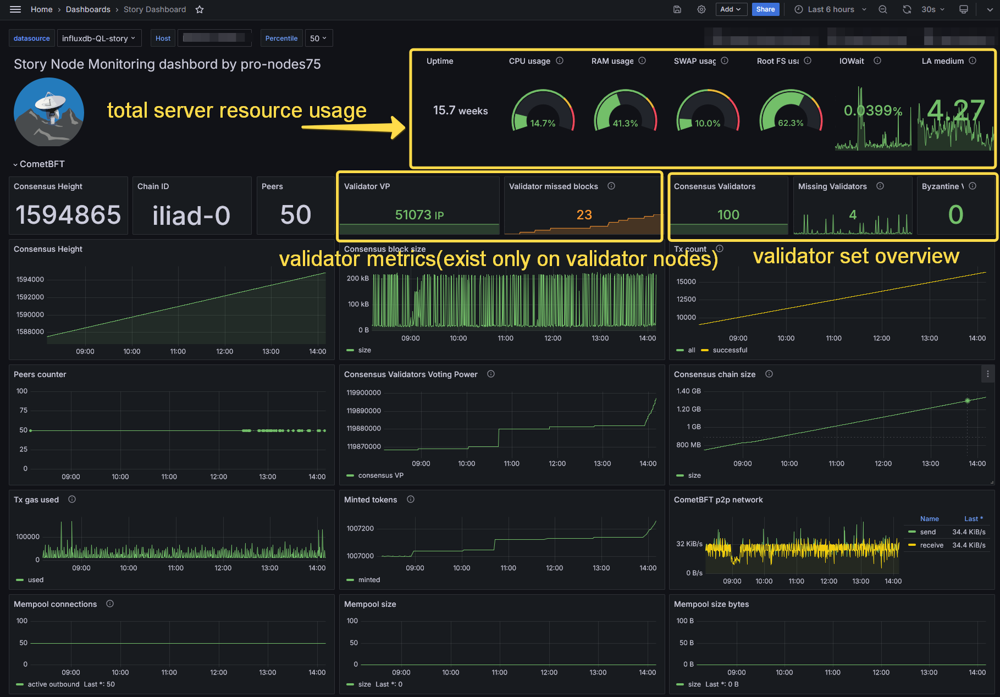
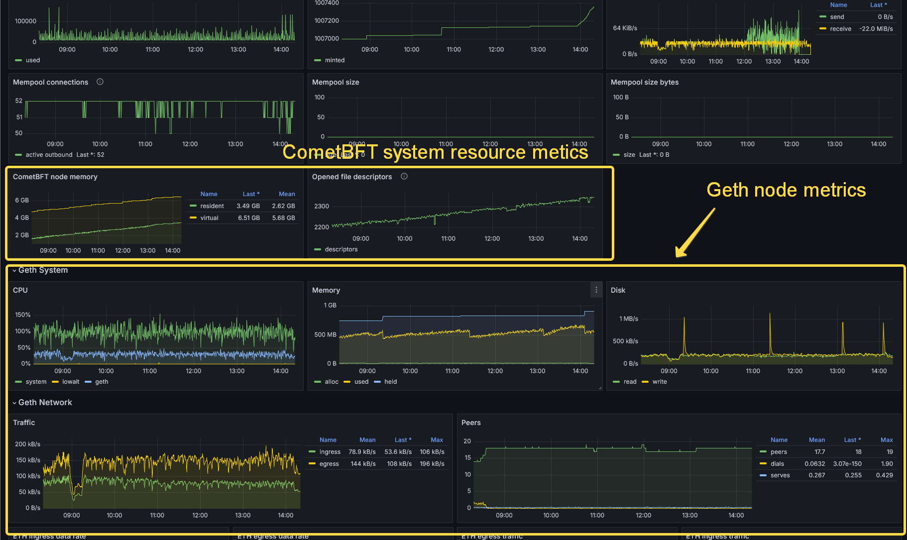
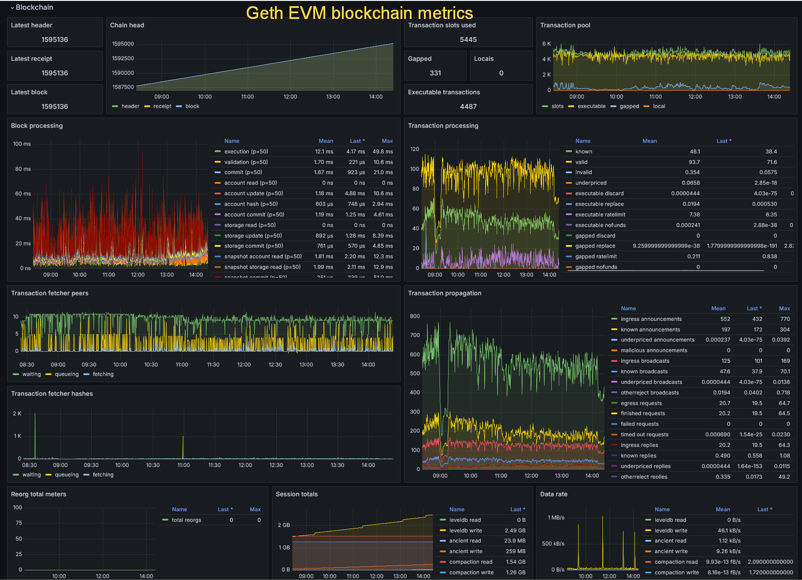

# Story node monitoring tool
Monitoring tool for Story node based on Telegraf/InfluxDB/Grafana

To monitor you node your should have installed and configured:
On node server:
* [Story consensus + Geth nodes](https://docs.story.foundation/docs/node-setup) which should be configured (correct moniker, validator key, network ports setup)
* [Telegraf agent](https://www.influxdata.com/time-series-platform/telegraf/)
* [mon_story](https://github.com/the-node75/mon_story) this repo

On monitoring server:
* [InfluxDB](https://www.influxdata.com/products/influxdb/)
* [Grafana](https://grafana.com/)

It is possible to install the software on the node server instance. Hovewer, it is better to move it to standalone instance with opened web access to watch it from browser at any location.

## Features 

* General server's metrics (CPU load, RAM/Swap usage, Storage, Network statistic)
* CometBFT node monitoring (block height, peers cnt, VP, missed blocks, etc)
* Geth node monitoring (based on official Geth dashboard)

## Dashboard View

## The following steps will guide you through the setup process:

* [Setup monitoring server ](./doc/setup_monitoring_server.md)
* [Setup monitoring on node](./doc/setup_node_monitoring.md)

